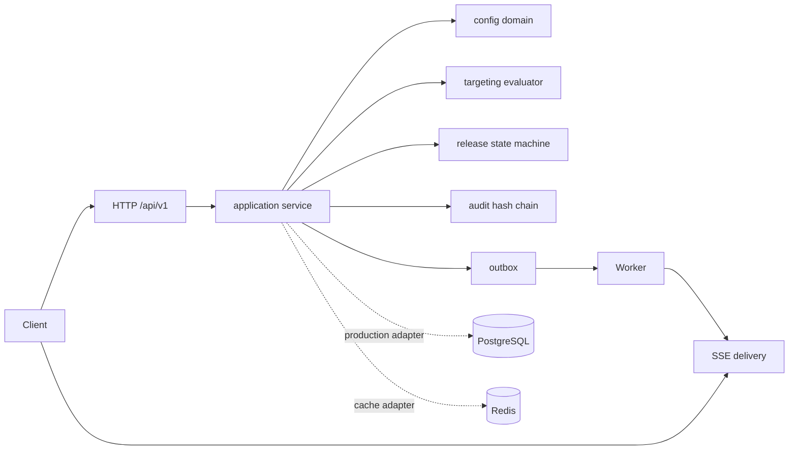

# Architecture

The HTTP transport is intentionally thin. `internal/configdomain` has no transport or storage imports. The application service owns orchestration, audit append and outbox emission. Interfaces are the boundary for PostgreSQL and Redis adapters; the development build uses a concurrency-safe in-memory adapter.

### Consistency

Configuration and release records carry revisions. Writes use the current revision as an optimistic-lock precondition. Release transitions additionally require a monotonically increasing fencing token, so an old worker lease cannot pause or roll back a newer release. Production persistence must atomically write aggregate state plus outbox rows in one PostgreSQL transaction.

### Capacity and SLO

One API instance targets 5,000 read evaluations/s with a 20 ms p99 when the published snapshot resides in memory. A 512 MiB pod reserves ~350 MiB for 100k compact keys and uses bounded SSE subscriber buffers (64 events). Alert at p99 > 50 ms, outbox age > 30 s, or release pause rate > 2%.
