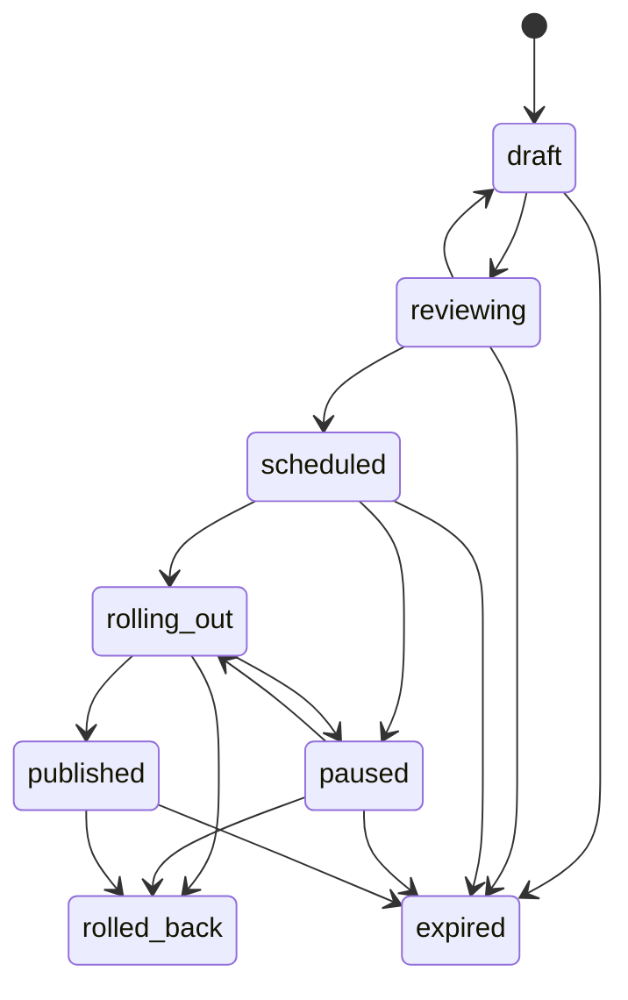
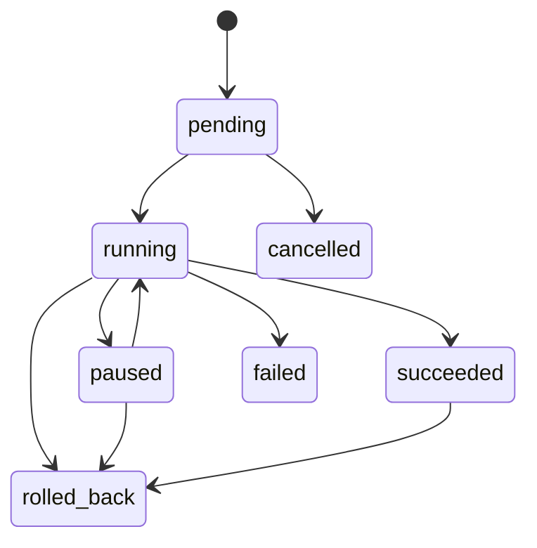

# Domain Model and State Machines

`Scope` is the tenant/application/environment/namespace isolation key. A `Config` owns immutable numbered `ConfigVersion` records. Values are JSON encoded and tagged as string, number, boolean, JSON, secret reference, or template. Secret references never contain secret material.

Target rules are evaluated by descending priority. Time window, label, device attributes and experiment exclusion are checked before a deterministic SHA-256 bucket is compared with the configured percentage. The response contains each rejection explanation, matching rule, version and HMAC proof.
